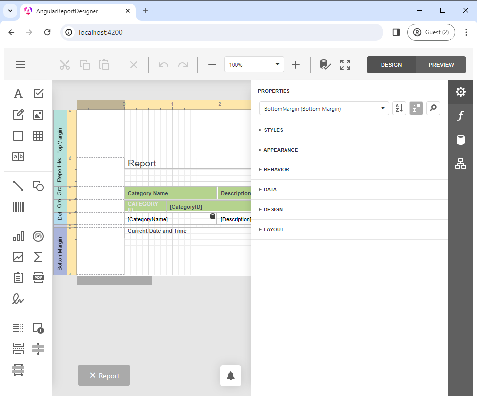

<!-- default badges list -->

[](https://supportcenter.devexpress.com/ticket/details/T566422)
[](https://docs.devexpress.com/GeneralInformation/403183)
<!-- default badges end -->
# Reporting for Angular - How to Integrate the DevExpress Web Report Designer into an Angular App

This example adds the DevExpress Web Report Designer to an Angular-powered client-side app. The sample consists of two distinct parts:

- A server-side (back-end) ASP.NET Core project that enables [cross-domain requests (CORS)](https://developer.mozilla.org/en-US/docs/Web/HTTP/CORS) (Access-Control-Allow-Origin) and implements custom web report storage.

- An [Angular](https://angular.io/) front-end client application.

The `angular-report-designer` contains an Angular application (created by following the steps outlined in the following help topic): [Create an Angular Front-End Application with a Report Designer](https://docs.devexpress.com/XtraReports/119431)

The `ServerSideAspNetCoreReportingApp` folder contains an ASP.NET Core server-side (back-end) application (created using configuration settings outlined in the following help topic): [Report Designer Server-Side Configuration (ASP.NET Core)](https://docs.devexpress.com/XtraReports/400196/web-reporting/javascript-reporting/server-side-configuration/report-designer/report-designer-server-side-configuration-asp-net-core). The application enables [cross-domain requests (CORS)](https://developer.mozilla.org/en-US/docs/Web/HTTP/CORS) (Access-Control-Allow-Origin) and implements a custom web report storage.

> [!TIP]
> Make certain that the backend application runs on the port specified within the host setting of the DevExpress Report Designer component. For more information, refer to the following help topic:  [Determine the Host URL](https://docs.devexpress.com/XtraReports/400196/web-reporting/asp-net-core-reporting/server-side-configuration/report-designer-server-side-configuration-asp-net-core#step-3-determine-the-host-url).

When you start the back-end application and execute the Angular application in the `angular-report-designer` folder, the following will appear on-screen:




## How to Run the Project

To run the project, start the `ServerSideAspNetCoreReportingApp` application, install npm packages with the `npm install` command in the `angular-report-designer` folder, and run the `npm start` command.

Before you run the project, verify the DevExpress version used. If using an older version, upgrade DevExpress Reports. Make certain to use the same DevExpress component versions for both front-end and back-end applications.

Follow these steps to update the project:

### Upgrade the server-side app

Use the [DevExpress Project Converter](https://docs.devexpress.com/ProjectConverter/2529/project-converter) to upgrade assembly references for the back-end project solution. You can open the project in Visual Studio and navigate to the Menu: Extensions -> DevExpress -> Project Converter. Select the required version and upgrade the project.

### Upgrade the client-side app

Navigate to the `package.json` file in the **angular-report-designer** folder and change all DevExpress script versions to the version you're using on the server side. If you're using v23.2.3, modify the **package.json** file as follows:

```
    {
        ...
        "devextreme-angular": "23.2.3",
        "devextreme": "23.2.3",
        "devexpress-richedit": "23.2.3",
        "@devexpress/analytics-core": "23.2.3",
        "devexpress-reporting-angular": "23.2.3"
        ...
    }
```

Open the `angular-report-designer` folder in the console and run the command to download updated packages:

```
npm install
```

### Run the Example

Perform the following steps to run this example:

1. Open the back-end project solution (**ServerSideAspNetCoreReportingApp.sln**) in Visual Studio and run the project.
2. Navigate to the angular-report-designer folder (client root folder).
3. Open the console and run the following command:

```npm install```

4. Run the command to compile and start the client portion of this example:

    ```npm start```

5. Open your browser (http://localhost:4200/) to view results.

### Documentation 

* [Create an Angular Front-End Application with a Report Designer](https://docs.devexpress.com/XtraReports/119431)
* [Document Viewer Server-Side Application (ASP.NET Core)](https://docs.devexpress.com/XtraReports/400197) 
* [Document Viewer's Server-Side Configuration (ASP.NET MVC)](https://docs.devexpress.com/XtraReports/118597)
* [Troubleshooting](https://docs.devexpress.com/XtraReports/401726/web-reporting/general-information/troubleshooting)
* [Reporting Application Diagnostics](https://docs.devexpress.com/XtraReports/401687/web-reporting/general-information/application-diagnostics)

## Files to Review

- [app.component.ts](angular-report-designer/src/app/app.component.ts)
- [app.component.html](angular-report-designer/src/app/app.component.html)
- [Program.cs](ServerSideAspNetCoreReportingApp/ServerSideAspNetCoreReportingApp/Program.cs)
- [ReportingControllers.cs](ServerSideAspNetCoreReportingApp/ServerSideAspNetCoreReportingApp/Controllers/ReportingControllers.cs)

## More Examples

* [How to use the Web Document Viewer in JavaScript with Angular](https://github.com/DevExpress-Examples/Reporting_how-to-use-the-web-document-viewer-in-javascript-with-angular-t566419)
