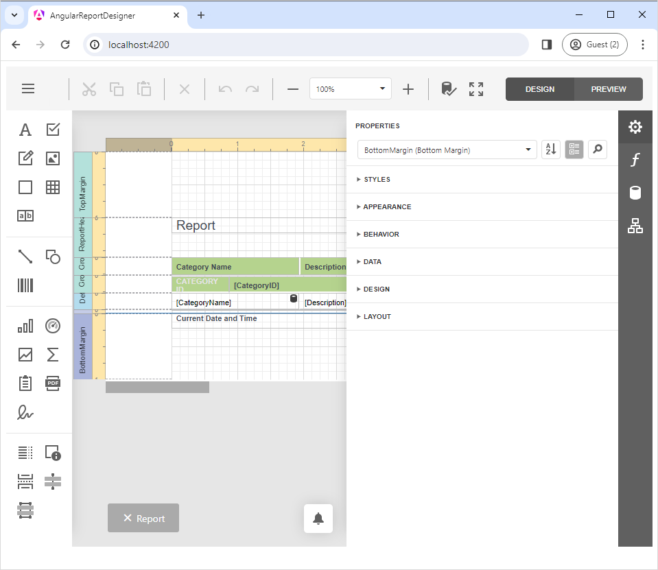

<!-- default badges list -->

[](https://supportcenter.devexpress.com/ticket/details/T566422)
[](https://docs.devexpress.com/GeneralInformation/403183)
[](#does-this-example-address-your-development-requirementsobjectives)
<!-- default badges end -->
# Reporting for Angular - Integrate a Web Report Designer into an Angular App

This example incorporates the Web Report Designer into a client-side app built with Angular. The example consists of two parts:

- The [ServerApp](ServerApp) folder contains the backend project. The project is an ASP.NET Core application that enables [cross-domain requests (CORS)](https://developer.mozilla.org/en-US/docs/Web/HTTP/CORS) (Access-Control-Allow-Origin) and implements custom web report storage.

- The [angular-report-designer](angular-report-designer) folder contains the client application built with [Angular](https://angular.io/).

## Quick Start

### Server

In the *ServerApp* folder, run the following command:

```
dotnet run
```

The server starts at http://localhost:5000. To debug the server, run the application in Visual Studio.

### Client

In the *angular-report-designer* folder, run the following commands:

```
npm install
npm start
```

Open your browser (http://localhost:4200/) to see the result. The application displays the Web Report Designer.




### Documentation 

* [Create an Angular Front-End Application with a Report Designer](https://docs.devexpress.com/XtraReports/119431)
* [Document Viewer Server-Side Application (ASP.NET Core)](https://docs.devexpress.com/XtraReports/400197) 
* [Document Viewer's Server-Side Configuration (ASP.NET MVC)](https://docs.devexpress.com/XtraReports/118597)
* [Troubleshooting](https://docs.devexpress.com/XtraReports/401726/web-reporting/general-information/troubleshooting)
* [Reporting Application Diagnostics](https://docs.devexpress.com/XtraReports/401687/web-reporting/general-information/application-diagnostics)

## Files to Review

- [app.component.ts](angular-report-designer/src/app/app.component.ts)
- [app.component.html](angular-report-designer/src/app/app.component.html)
- [Program.cs](ServerApp/Program.cs)
- [ReportingControllers.cs](ServerApp/Controllers/ReportingControllers.cs)

## More Examples

* [How to use the Web Document Viewer in JavaScript with Angular](https://github.com/DevExpress-Examples/Reporting_how-to-use-the-web-document-viewer-in-javascript-with-angular-t566419)
<!-- feedback -->
## Does this example address your development requirements/objectives?

[](https://www.devexpress.com/support/examples/survey.xml?utm_source=github&utm_campaign=reporting-angular-integrate-report-designer&~~~was_helpful=yes) [](https://www.devexpress.com/support/examples/survey.xml?utm_source=github&utm_campaign=reporting-angular-integrate-report-designer&~~~was_helpful=no)

(you will be redirected to DevExpress.com to submit your response)
<!-- feedback end -->
